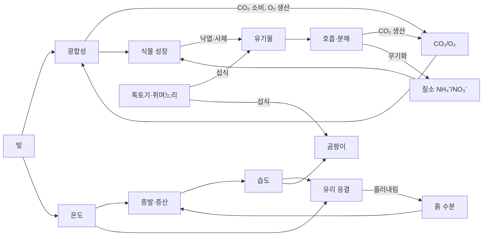

# Terrarium: 기획서 (v0.3)

> 유리병 속 작은 생태계를 **실제 물리·화학·생물 법칙**에 가깝게 시뮬레이션하고, 그 결과를 **고퀄리티 3D 그래픽**으로 보여주는 샌드박스 게임.

---

## 1. 핵심 컨셉

- **"보이는 것은 전부 시뮬레이션 결과다."** 유리에 맺힌 물방울은 텍스처 연출이 아니라 *유리 온도 < 이슬점*이라서 생긴 것이고, 잎이 노랗게 변하는 건 *질소 결핍*, 잎이 처지는 건 *팽압 손실* 때문이다.
- 플레이어는 **설계자이자 관리자**. 용기·흙층·식물·동물을 골라 테라리움을 만들고, 창가에 두거나 뚜껑을 열고 분무를 하며 균형을 잡는다.
- 최종 목표 예시: David Latimer의 병 정원(1960년 밀봉 후 수십 년 생존)처럼 **완전 밀폐 상태로 자립하는 생태계** 만들기.

### 설계 원칙
1. **보존 법칙 우선**: 물·탄소·질소·에너지는 생기거나 사라지지 않는다. 모든 흐름을 장부(ledger)로 추적한다.
2. **규칙에서 창발**: "곰팡이가 생긴다" 같은 이벤트를 스크립트하지 않는다. 습도·통풍·유기물 조건이 맞으면 *자연히* 생긴다.
3. **데이터 주도**: 종(species)별 파라미터는 코드가 아닌 데이터 파일에, 가능한 한 **문헌 출처**와 함께 둔다.
4. **복잡도는 숨길 수 있게**: 캐주얼 보기(예쁜 테라리움) ↔ 과학자 보기(그래프·히트맵·수치) 전환.

---

## 2. 시뮬레이션 변수 전체 지도

### 2.1 물리 환경

| 영역 | 변수 | 단위 | 주요 모델 |
|---|---|---|---|
| **빛** | 광합성유효광량(PAR), 스펙트럼(적/청/원적색 비율), 광주기, 입사 방향 | µmol·m⁻²·s⁻¹ | 유리 투과율, 잎층 차광 Beer–Lambert (`I = I₀·e^(−k·LAI)`) |
| **온도** | 공기·유리·흙(층별)·잎 온도 | °C | 열용량 기반 에너지 수지: 복사 흡수(온실효과), 유리 전도(U값), 증발/응결 잠열 |
| **습도** | 절대습도, 상대습도(RH), 이슬점, 증기압차(VPD) | g/m³, %, kPa | Magnus 식 `eₛ(T)=0.6108·exp(17.27T/(T+237.3))`, `RH=e/eₛ`, `VPD=eₛ−e` |
| **응결** | 유리 내벽 수막/물방울 양 | g/m² | `e_air > eₛ(T_glass)`일 때 응결, 방울이 커지면 흘러내려 흙으로 복귀 |
| **토양 수분** | 층별 체적함수율, 수분퍼텐셜, 배수층 수위 | m³/m³, kPa | van Genuchten 보수곡선 + 층간 Darcy 흐름(단순화된 Richards) |
| **기체** | CO₂, O₂ | ppm, % | 광합성/호흡/분해 수지 + 뚜껑 틈 환기율(ACH)로 실내공기와 교환 |
| **토양 화학** | pH, NH₄⁺, NO₃⁻, P, K, 유기물, C:N 비, EC(염분), 산소(혐기 여부) | mg/kg 등 | 질소 순환: 암모니아화 → 질산화(호기) → 흡수 / 탈질(혐기) |

### 2.2 생물

> 상세 파라미터와 출처: [RESEARCH.md](RESEARCH.md)

| 그룹 | 종 / 기능 그룹 | 모델링 방식 | 핵심 변수 |
|---|---|---|---|
| **이끼** | *Hypnum*, *Leucobryum* | 매트(셀별 피복률), **변수성 수분 모델** | 조직 함수율 ↔ 공기 VPD, 휴면/회복, 광저해 |
| **관다발 식물** | 피토니아, 필레아, 부처손, 소형 양치, 트라데스칸티아, 푸밀라, 페페로미아 | 개체 기반 + 기관별(잎/줄기/뿌리) 탄소·N 풀 | 광합성, 호흡, 증산, Medlyn 기공, 팽압, 탄소 배분, 스트레스, 번식 |
| **대형 청소부** | 쥐며느리(*Porcellio scaber*), 공벌레, 노래기(*Oxidus*), 달팽이(*Subulina*), 지렁이(대형 용기) | **개별 에이전트** | MTE 대사, 탈수, 칼슘, 행동(빛 회피, 습한 곳 선호), 번식, 사망 → 사체 |
| **소형 청소부** | 톡토기(*Folsomia*), 꼬마흰쥐며느리(*Trichorhina*), 날개응애 | 흙 셀별 **코호트**(알/유충/성충) | 적산온도 발육, 습도 생존율, 곰팡이 섭식 |
| **포식자** | 포식 응애(*Stratiolaelaps*) | 코호트 | 섭식 반응(하루 1–5마리), 먹이: 버섯파리 유충·톡토기 |
| **해충** | 버섯파리(*Bradysia*), 물가파리(*Scatella*) | 코호트 | 과습·곰팡이·조류에서 폭증, 유충이 어린 뿌리 가해 |
| **미소동물** | 세균식 선충, 곰팡이식 선충, 원생생물 | 셀별 바이오매스 풀 | 미생물 고리: 세균 섭식 → NH₄⁺ 배출 |
| **세균** | 호기성 분해균, 방선균, 질산화균, 탈질균, 황산염환원균, 메탄생성균 | 셀별 기능 그룹 바이오매스 | 산화환원 순서, C:N 화학량론, CUE |
| **균류** | 부생 곰팡이(*Trichoderma*), 회색곰팡이(*Botrytis*), 노란 버섯(*Leucocoprinus*), 균근균 | 셀별 균사 바이오매스 + 자실체 이벤트 | VTT 곰팡이 지수(RH·시간), 톡토기 섭식 압력 |
| **기타** | 난균 *Pythium*(뿌리 썩음), 점균류, 조류·남세균(유리 막) | 셀/유리 면 풀 | 흙 산소, 빛, 젖은 표면 |

### 2.3 식물 생리 모델 (핵심)

- **광합성**: 1단계는 비직각쌍곡선 광반응 곡선 × CO₂ 포화(Michaelis–Menten) × 온도 최적 곡선. 2단계에서 Farquhar–von Caemmerer–Berry 모델로 교체 가능.
- **호흡**: `R = R_ref · Q10^((T − T_ref)/10)`
- **증산**: `E = g_s · VPD / P` — 기공전도도 `g_s`는 빛·CO₂·잎 수분 상태로 조절(Ball–Berry 계열).
- **수분 수송**: 흙 수분퍼텐셜 → 뿌리 → 잎. 흙이 마르면 팽압 손실 → **시각적 시듦**.
- **탄소 배분**: 광합성 산물을 잎/줄기/뿌리에 배분. 빛 부족 → 웃자람(도장), 영양 부족 → 뿌리 비중 증가.
- **스트레스 & 사망**: 가뭄, 과습(뿌리 썩음 = 혐기 + 병원균), 고온, 광 과다(잎 탐), N 결핍(황화). 죽은 조직은 유기물(낙엽)로 흙에 들어간다.

### 2.4 연결되는 순환



- **물 순환**: 흙·잎 → 증발/증산 → 공기 → 유리 응결 → 흘러내림 → 흙
- **탄소 순환**: 낮엔 광합성으로 CO₂ 감소, 밤엔 호흡으로 증가 (밀폐 병에서 실제로 큰 일교차를 보임)
- **질소 순환**: 배설물/사체 → 무기화 → 식물 흡수; 과습 혐기 조건이면 탈질로 손실
- **먹이 관계**: 곰팡이 ↔ 톡토기 (톡토기가 곰팡이를 억제하는 실제 바이오액티브 테라리움 원리)

---

## 3. 시공간 구조

### 공간
- **공기**: 처음엔 **단일 구역(well-mixed)** 으로 시작 → 이후 수직 3~5층 구역으로 세분화(위는 따뜻하고 습함, 아래는 차가움).
- **흙**: 2.5D 격자 — 바닥 평면을 N×M 칼럼으로 나누고, 각 칼럼은 층(배수층 LECA / 분리망 / 활성탄 / 배양토 / 이끼)을 가짐.
- **유리**: 면(面)별 온도 + 응결 맵(텍스처 해상도로 따로 관리 → 그래픽과 직결).

> 원칙: **"뭉쳐서(lumped) 시작하고, 필요할 때 공간을 쪼갠다."** 처음부터 3D 복셀 유체 시뮬레이션은 하지 않는다.

### 시간 (다중 속도)
| 계층 | 주기 | 대상 |
|---|---|---|
| 빠름 | 1 시뮬레이션-분 | 열, 습도, 응결, 기체, 기공 반응 |
| 중간 | 10분 | 광합성/증산 누적, 토양 수분 이동, 미생물 |
| 느림 | 1시간~1일 | 성장·형태 변화, 개체군 발육·번식, 분해, 계절 |

- 속도 조절: 1× ~ 약 100,000× (1초 = 1일 이상). 빠른 배속에서도 안정하도록 **서브스텝 + 암시적(implicit) 적분**을 사용.
- 결정론적(seeded RNG) → 저장/불러오기, 재현, 테스트가 가능.

---

## 4. 그래픽 목표

| 요소 | 구현 방향 | 시뮬레이션 연결 |
|---|---|---|
| 유리 | 굴절·투과(transmission), 프레넬 반사, 두께 | 응결 맵 → 물방울/김서림 노멀·거칠기, 방울이 흘러내리는 자국 |
| 빛 | 창가 햇빛/LED, 볼륨라이트(god rays), 커스틱 | 실제 PAR 계산과 같은 광원 사용 |
| 식물 | 절차적 생성(L-system / space colonization), 잎 SSS(반투과), 인스턴싱 | 성장·잎 각도(팽압)·색(엽록소/황화)·갈변 |
| 이끼 | 셸 텍스처링 / 인스턴스 카드 | 수분 상태에 따라 색·부피 변화 (마르면 갈색으로 오그라듦) |
| 흙 | 유리 너머 층 단면이 보이도록 | 층별 수분 → 색이 짙어짐, 배수층 물 고임 |
| 생물 | 쥐며느리 애니메이션, 톡토기는 파티클 | 개체 위치·활동량 |
| 곰팡이 | 흰 균사 데칼/파티클 | 셀별 곰팡이 바이오매스 |
| 후처리 | TAA, SSAO, 블룸, **접사 느낌의 피사계심도** | — |
| 카메라 | 자유 회전 + 매크로 줌 + **타임랩스 녹화** | — |

---

## 5. 게임플레이

### 모드
- **샌드박스**: 제약 없이 만들고 관찰.
- **도전 과제**: "밀폐 1년 생존", "뚜껑 닫고 곰팡이 없이 90일", "창가(직사광) 조건에서 과열 없이 버티기".
- **시나리오 이벤트**: 여름 폭염(실내 온도 상승), 정전(조명 꺼짐), 버섯파리 유입.

### 플레이어 행동
- **만들기**: 용기(병/어항/웨디안 케이스, 크기, 뚜껑 종류) → 흙층 구성 → 돌·유목 배치 → 식물 심기 → 생물 투입
- **관리**: 분무, 물 주기, 뚜껑 열기/닫기, 가지치기, 곰팡이 제거, 비료, 위치 이동(창가/실내/LED)
- **관찰**: 측정 프로브(클릭한 곳의 온도·습도·수분), 시간별 그래프, 히트맵 오버레이(습도/온도/CO₂/곰팡이 위험), 도감(종별 상태)

---

## 6. 기술 스택 (제안)

**웹 기반 (TypeScript + Three.js)** 로 결정:
- 설치 없이 브라우저에서 바로 실행, 공유 쉬움.
- **Three.js**: WebGL2(`MeshPhysicalMaterial` 투과·굴절 + 커스텀 셰이더)로 시작 → 브라우저 지원이 충분해지면 WebGPURenderer/TSL로 이전.
- 시뮬레이션은 **Web Worker**에서 렌더링과 분리 실행, 상태는 TypedArray(SoA)로 전달.
- 무거운 부분(토양 격자, 개체군)은 필요 시 **Rust → WASM** 또는 WebGPU compute로 이식.
- UI: 의존성 없는 가벼운 DOM + 캔버스 그래프(필요 시 프레임워크 도입). 빌드: Vite. 테스트: Vitest.

대안: 그래픽 퀄리티를 최우선하고 PC 전용이어도 되면 **Unreal 5 / Unity HDRP**, 가볍게 가려면 **Godot 4**. 이 경우에도 아래 구조(시뮬 코어 분리)는 동일하게 유지.

### 아키텍처

처음엔 모노레포 없이 **단일 Vite 앱**으로 시작하고, `src/sim`은 DOM에 의존하지 않게 유지한다(나중에 패키지로 분리 가능).

```
terrarium/
├─ src/
│  ├─ sim/               # 순수 TS, DOM 없음, 결정론적
│  │  ├─ physics/        # psychro(습공기), light, thermal(암시적 열망), soil(vG 수분)
│  │  ├─ bio/            # (M2~) plant, moss, fauna, microbe
│  │  ├─ model.ts        # 상태 생성 + step()
│  │  └─ ledger.ts       # 물·C·에너지 보존 검증
│  ├─ data/              # 재료·종 파라미터 JSON (+출처, confidence)
│  ├─ worker/            # 시뮬레이션 Web Worker
│  ├─ render/            # Three.js 씬, 유리/응결 셰이더
│  └─ ui/                # HUD, 그래프, 조작
├─ tests/                # Vitest: 단위 + 헤드리스 시나리오
└─ docs/
```

- `sim`은 렌더러를 전혀 모름 → 헤드리스로 몇 년치를 몇 초 만에 돌려 **밸런스·회귀 테스트** 가능.
- 각 모듈은 `step(state, dt)` 형태 + 명확한 입력/출력 플럭스.
- 강성(stiff) 문제: 공기 열용량(~20 J/K)이 유리(~2000 J/K)보다 훨씬 작아 명시적 적분은 불안정 → **열망(thermal network) 후방 오일러 선형해**, 수증기도 **암시적 스칼라 해**, 흙 수분은 **적응형 서브스텝**.

---

## 7. 검증 전략 (현실성을 어떻게 보장하나)

1. **보존 테스트**: 매 스텝 물·탄소·질소 총량 변화 = 외부 교환량(환기 등). 어긋나면 테스트 실패.
2. **단위 테스트**: Magnus 식, Q10, 보수곡선 등을 알려진 값과 비교.
3. **정성적 시나리오 테스트** (헤드리스로 N일 실행 후 확인):
   - 밀폐 병 → RH 90~100%, 아침 유리 김서림
   - 식물 있는 밀폐 병 → 낮 CO₂ 감소 / 밤 증가
   - 직사광 + 밀폐 → 과열로 식물 스트레스
   - 과습 + 무통풍 + 톡토기 없음 → 곰팡이 증가 / 톡토기 투입 → 억제
4. **실측 비교(선택)**: 실제 테라리움에 저가 센서(온습도, CO₂)를 넣고 기록해 곡선을 비교·튜닝.

---

## 8. 로드맵

| 단계 | 내용 | 결과물 |
|---|---|---|
| **M0 기반** ✅ | 프로젝트 구조, Vite+TS+Three.js, Worker, 테스트, 시간 스케줄러 | 빈 씬 + 시간 흐름 |
| **M1 빈 병의 물리** ✅ | 빛·열·습도·응결·흙 수분 (생물 없음), 디버그 그래프 | 유리 병 + 흙 + **실시간 김서림/물방울** ← 첫 "와!" 포인트 |
| **M2 첫 식물** ✅ | 이끼 1종 + 양치 1종, 광합성/호흡/증산, CO₂/O₂ | 낮밤 CO₂ 곡선, 물 부족 시 시듦 |
| **M3 토양 생태** ✅ | 유기물 풀(CENTURY식), 세균·곰팡이·방선균, 원생생물·선충(미생물 고리), 질산화/탈질, 산화환원 순서, 곰팡이 지수, Pythium | 낙엽 → 분해 → 영양, 새 테라리움 곰팡이 폭발, 과습 시 H₂S |
| **M4 동물** ✅ | 톡토기·꼬마흰쥐며느리(코호트), 쥐며느리·노래기·달팽이(에이전트), 버섯파리·포식 응애, 조류·물가파리, 점균류·노란 버섯 | 곰팡이–톡토기 균형, 해충–포식자 동역학 |
| **M5 그래픽 고도화** ✅ | 절차적 식물 성장, SSS, 볼륨라이트, 피사계심도, 이끼 셰이더 | 스크린샷 퀄리티 |
| **M6 게임화** ✅ | 만들기 모드, 관리 도구, 도전 과제, 저장/불러오기, 타임랩스 | 플레이 가능한 버전 |
| **M7 확장/밸런싱** ✅ | 종 추가, 공간 세분화, 계절, 실측 비교 튜닝 | — |

M1을 가장 먼저 하는 이유: **습도·응결은 이 게임의 정체성**이고, 이후 모든 생물 모델이 이 물리 환경 위에서 돌아가기 때문.

---

## 9. 리스크와 대응

| 리스크 | 대응 |
|---|---|
| 변수 폭증으로 디버깅 불가 | 모듈 간 플럭스 인터페이스 고정, 보존 장부, 헤드리스 시나리오 테스트 |
| 고배속에서 수치 불안정 | 서브스텝, 암시적 적분, 값 클램프 + 경고 로그 |
| 현실적이지만 재미없음 | 빠른 배속 + 타임랩스로 변화를 "보이게", 도전 과제, 문제 발생 시 원인 추적 UI("왜 곰팡이가 생겼나?") |
| 종 파라미터 부족 | 문헌값 우선, 없으면 유사종 추정 + `confidence` 필드로 표시 |
| 브라우저 성능 | 시뮬 LOD(개체군↔에이전트), Worker 분리, WASM/compute 이식 여지 |

---

## 10. 결정 사항 (v0.2 기본값)

| 항목 | 결정 | 비고 |
|---|---|---|
| 플랫폼 | **웹 (TypeScript + Three.js)** | WebGL2로 시작, WebGPU는 이후 |
| 게임성 | **샌드박스 + 도전 과제** | M6에서 과제 추가 |
| 현실성 | **단순 물리 모델부터, 단계적으로 정교화** | 모든 파라미터에 출처/confidence |
| 첫 테마 | **열대 밀폐형** (이끼·양치·톡토기·쥐며느리) | 건조형·팔루다리움은 M7 |

---

## 11. 구현 현황 (v0.3, M0–M7)

| 영역 | 구현 | 남은 과제 |
|---|---|---|
| 물리 | 태양·구름·배치별 빛, 열 네트워크(암시적), 수증기·응결·흘러내림, van Genuchten 흙 수분, 가스 환기, 계절 실내 온도 | 공기 수직 구역 분할, 유리 굴절 광학 |
| 식물 | 광반응 × CO₂ × 온도 × N, Medlyn 기공, 조직 수분·팽압, CAM, 배분(웃자람·뿌리 비중), 잎·뿌리 교체, 번식(러너·포자), 스트레스·죽음 | Farquhar 모델, 잎 온도 에너지 수지 |
| 이끼 | 변수성 수분(흡습·모세관), 수분 의존 광합성, 건조 휴면·과습 부패, 확산 | 종 추가 |
| 흙 | 대사성/구조성/부식, 세균·곰팡이·표면 곰팡이, 원생생물·선충(미생물 고리), 질산화·탈질, 산화환원 사다리(H₂S·CH₄), Pythium | P·K·pH, 균근 네트워크 |
| 동물 | MTE 대사; 코호트(톡토기, 꼬마흰쥐며느리, 포식 응애, 버섯파리, 물가파리); 에이전트(쥐며느리, 노래기, 달팽이, 지렁이) | 개체 수준 행동 다양화 |
| 기타 | 유리 녹조막, 노란 버섯, 점균, 무작위 사건(폭염·정전·버섯파리 유입) | |
| 게임 | 프리셋 5종, 관리 도구, 도전 과제 5종, 원인 설명, 저장/불러오기, 타임랩스, 접사 | 튜토리얼, 소리 |
| 검증 | 43개 테스트: 공식, 물·탄소·질소 보존, 12개 현상 시나리오, 프리셋, 저장 결정론 | 실측 센서 데이터 비교 |
