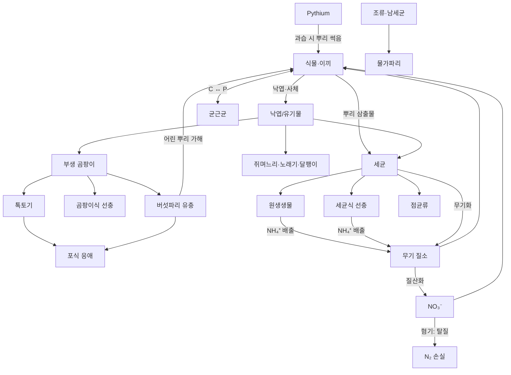

# 테라리움 생태계 지식 베이스 (v0.1)

시뮬레이션 모델과 종 파라미터의 **근거 자료**. 코드의 데이터 파일(`src/data/*.json`)은 이 문서의 수치를 따르고, 각 값에 `confidence`(high / medium / low)를 붙인다.

- **high**: 동료심사 문헌·교과서의 측정값
- **medium**: 문헌 범위에서 대표값을 고른 것, 또는 유사종 값
- **low**: 사육 가이드·경험칙, 또는 게임 밸런스를 위한 추정

---

## 1. 밀폐 테라리움은 어떻게 유지되는가

David Latimer의 병 정원(1960년 조성, 1972년 물 1/4파인트 추가 후 계속 밀폐)은 창에서 약 1.8 m 떨어져 있고, 스파이더워트(*Tradescantia*) 한 종과 퇴비로 수십 년을 유지했다. 이 사례에서 알 수 있는 세 가지 순환은 다음과 같다. ([Snopes](https://www.snopes.com/fact-check/self-sustaining-bottle-garden-1960/), [Wikipedia: Bottle garden](https://en.wikipedia.org/wiki/Bottle_garden))

1. **물**: 뿌리 흡수 → 증산 → 유리 응결 → 흙으로 복귀. 밀폐하면 외부와 교환이 거의 없다.
2. **탄소/산소**: 낮에는 광합성으로 CO₂가 줄고, 밤에는 호흡과 분해로 늘어난다. 밀폐 용기에서는 이 **일주기 변동**이 뚜렷하다. 식물 호흡보다 **세균 호흡이 CO₂ 공급의 대부분**을 맡는다. ([terrariumm.com](https://terrariumm.com/how-do-closed-terrariums-get-carbon-dioxide/), [ResearchGate Q&A](https://www.researchgate.net/post/Carbon-Dioxide-Concentration-in-a-Terrarium))
3. **양분**: 죽은 조직 → 분해 → 무기화 → 재흡수. 식물이 크게 자라면 탄소가 식물체에 쌓이고, 분해가 이를 되돌린다. 장기적으로는 **생산 ≈ 분해**에 가까운 준평형 상태에 이른다.

> 게임 설계 시사점: 밀폐 생태계의 "성공"은 **순생산(NPP) ≈ 분해 호흡**이고, 물·N이 누출되지 않는 상태다. 이 평형을 벗어나는 방향(과습, 과광, 과영양)이 곧 게임의 도전 과제다.

---

## 2. 물리 환경 (교과서 수준 모델)

| 항목 | 모델 / 값 | 출처 |
|---|---|---|
| 포화수증기압 | `eₛ(T) = 0.6108·exp(17.27T/(T+237.3))` kPa (Magnus–Tetens) | Campbell & Norman (1998) *An Introduction to Environmental Biophysics* |
| 수증기 밀도 | `ρv = e·Mw/(R·T_K)`, Mw = 0.018015 kg/mol | 이상기체 |
| 증발잠열 | L ≈ 2.501 − 0.00237·T (MJ/kg) | Campbell & Norman |
| 대류 열전달 (밀폐 용기 내부, 자연대류) | h ≈ 2–5 W/m²K | 공학 경험식 (medium) |
| 외부 유리면 (대류+복사) | h ≈ 8–10 W/m²K | 건축물리 표면열전달계수 (high) |
| 물질전달 | Lewis 유비 `h_m = h / (ρ·cp·Le^(2/3))`, Le ≈ 0.85 | Chilton–Colburn |
| 유리 | 소다석회 ρ=2500 kg/m³, cp=840 J/kgK, k=1.0 W/mK, 가시광 투과 ≈ 0.85–0.9 | 재료 데이터 (high) |
| 태양광 PAR ↔ 에너지 | 약 4.57 µmol/J (PAR), 단파 중 PAR 비중 ≈ 45% | McCree (1972) (high) |
| 흙 보수곡선 | van Genuchten: `θ(h)=θr+(θs−θr)/[1+(α|h|)ⁿ]^m`, m=1−1/n | van Genuchten (1980) (high) |
| 불포화 투수 | Mualem: `K=Ks·Se^0.5·[1−(1−Se^(1/m))^m]²` | Mualem (1976) (high) |
| 흙 표면 수분활동도 | Kelvin 식 `a_w = exp(ψ·Mw/(ρw·R·T))` | Campbell & Norman (high) |

### 2.1 배양토 수리 특성

피트·코이어 기반 배양토는 van Genuchten 모델 적합도가 매우 높다(R² ≥ 0.99). ([MDPI Water 10(6):722](https://doi.org/10.3390/w10060722)) 아래 표는 그 논문의 값을 직접 옮긴 것이 **아니라**, 원예 배지의 일반 범위에서 고른 대표값이다. 원문 표 수치로 교체하는 것이 TODO다.

| 재료 | θs | θr | α (1/m) | n | Ks (m/s) | confidence |
|---|---|---|---|---|---|---|
| 피트/코이어 배양토 | 0.85 | 0.10 | 8 | 1.6 | 1e-5 | medium |
| 활성탄 층 | 0.60 | 0.05 | 20 | 2.0 | 1e-4 | low |
| LECA(배수층, 입자 사이 공극) | 0.45 | 0.02 | 60 | 3.0 | 1e-2 | low |
| 이끼 매트 | 0.90 | 0.05 | 15 | 1.8 | 1e-4 | low |

- **모세관 장벽**: 굵은 LECA는 낮은 흡인력에서 이미 물을 잃으므로, 위의 배양토가 거의 포화될 때까지 물이 배수층으로 내려가지 않는다. 실제 테라리움의 "가짜 바닥" 효과이고, vG 모델에서 자연스럽게 나타난다.

---

## 3. 식물

### 3.1 공통 생리 모델

| 과정 | 모델 | 대표 파라미터 | 출처 |
|---|---|---|---|
| 광합성 | 비직각쌍곡선 광반응 × CO₂ 반응 × 온도 반응 → 이후 Farquhar | 음지식물 광보상점 ≈ 5–15 µmol/m²/s | [rseco.org](https://rseco.org/book/export/html/257.html), [ScienceDirect: Compensation point](https://www.sciencedirect.com/topics/agricultural-and-biological-sciences/compensation-point) |
| 기공 전도도 | Medlyn: `gs = g0 + 1.6(1 + g1/√D)·A/Ca` | C3 g1 ≈ 3.4–4.1 kPa^0.5, g0 ≈ 0.01 mol/m²/s | [GMD 8:431 (2015)](https://gmd.copernicus.org/articles/8/431/2015/gmd-8-431-2015.pdf), [PMC12650297](https://pmc.ncbi.nlm.nih.gov/articles/PMC12650297/) |
| 증산 | `E = gs·VPD/P` | — | Campbell & Norman |
| 호흡 | `R = R₂₅·Q10^((T−25)/10)`, Q10 ≈ 2 | 잎 암호흡 ≈ 광합성 최대치의 5–10% | 일반 문헌 (high) |
| 균근 비용 | 광합성 산물의 3–20%를 AMF에 제공하고, 인(P)을 공급받음 | 약 200 g C / g P | [PMC13306546](https://pmc.ncbi.nlm.nih.gov/articles/PMC13306546/), [Springer: Plant & Soil](https://link.springer.com/article/10.1007/s11104-017-3350-6) |

### 3.2 이끼 (선태류): 별도 모델 필요

- **변수성(poikilohydric)**: 뿌리와 관다발이 없다. 몸의 수분이 **주변 습도와 평형**을 이루며, 광합성은 빛·온도에 더해 **조직 함수율**에 크게 좌우된다. ([Proctor 2002, New Phytologist](https://nph.onlinelibrary.wiley.com/doi/10.1046/j.1469-8137.2002.00526.x), [Springer: Photosynthesis in poikilohydric plants](https://link.springer.com/chapter/10.1007/978-3-642-79354-7_16))
- **건조 내성**: 종마다 다르다. 마르면 휴면했다가 다시 젖으면 회복하지만, 오래 마르면 광합성 능력이 줄어든다. ([PMC9314017](https://pmc.ncbi.nlm.nih.gov/articles/PMC9314017/))
- 모델: 이끼 함수율 W(g물/g건중)를 상태 변수로 둔다. 광합성 = f(W)·f(I)·f(T). W는 공기 VPD와 흙 접촉으로 변한다. 너무 젖으면 CO₂ 확산이 막혀 광합성이 다시 감소하는 **종 모양 곡선**을 따른다.

| 종 | 광 요구 (PPFD) | 특징 | 출처 |
|---|---|---|---|
| *Hypnum* (시트 모스) | 20–120, 최적 80–100 µmol/m²/s | 넓게 퍼지는 카펫형, 줄기 조각이 약 10일 후 정착하고 4–5주에 확산 | [ariumology](https://ariumology.com/2026/02/13/full-spectrum-led-lighting-schedule-for-moss-growth-guide/), [theminicraft](https://www.theminicraft.com/blogs/moss-instructions/hypnum-moss-care-guide) |
| *Leucobryum glaucum* (쿠션 모스) | 100–150 µmol/m²/s | 둥근 쿠션형. 과습하면 갈변 | [terrariumcreations](https://terrariumcreations.com/leucobryum-glaucum-moss-in-terrariums-care-guide-to-help-your-moss-thrive/) |

### 3.3 관다발 식물 후보 (열대 밀폐형)

| 종 | 역할 | 비고 (confidence: low–medium, 원예 문헌) |
|---|---|---|
| *Fittonia albivenis* | 대표 전경 식물 | 건조하면 급격히 시들고 물을 주면 회복. 팽압 모델을 보여주기 좋다 |
| *Pilea glauca / depressa* | 소형 덩굴 | 빠른 성장 |
| *Selaginella* (부처손류) | 준 양치 | 높은 습도 요구 (RH > 70%) |
| 소형 양치 (*Pteris*, *Nephrolepis* 소형종) | 중경 | 포자 번식 |
| *Tradescantia* | Latimer 병의 주인공 | 강건함. 도장이 잘 보인다 |
| *Ficus pumila* | 벽 타기 | 유리면 방향 성장 |
| *Peperomia* 소형종 | 다육질 잎 | 과습에 약함 (뿌리 썩음) |

---

## 4. 동물 (청소부와 해충)

### 4.1 신진대사: 통합 모델

모든 동물에 **대사이론(MTE)** 을 기본값으로 쓰고, 문헌값이 있으면 덮어쓴다.

`B = b₀ · M^(3/4) · exp(−E / (k·T))`, E ≈ 0.65 eV, k = 8.617e-5 eV/K (Brown et al. 2004, *Ecology* 85:1771) (high)

- O₂ 소비 → CO₂ 배출(호흡률 RQ ≈ 0.85), 먹이 소비 = 대사 / 동화효율
- 발육은 **적산온도(degree-day)** 로 계산: 기준 온도 T_base 이상의 온도를 누적한다.

### 4.2 종 목록

| 종 | 영양 단계 | 모델 방식 | 핵심 파라미터 | 출처 |
|---|---|---|---|---|
| **톡토기** *Folsomia candida* | 곰팡이·유기물 섭식 | 코호트(알/유충/성충)를 흙 셀마다 | 최적 22–24 °C. 알은 21 °C에서 약 7일 후 부화, 약 3주에 성숙(5회 탈피). 수명 240일(15 °C) ~ 72일(26 °C). 산란 수는 **15 °C에서 최대**(2355개), 26 °C에서 209개. 선호 RH 85–95%, 최소 약 70%. 단위생식 | [Wikipedia](https://en.wikipedia.org/wiki/Folsomia_candida), [Paleobiology/ScienceDirect](https://www.sciencedirect.com/science/article/pii/S0031405622015591), [mesofauna.com](https://mesofauna.com/species-profiles/springtail-species-profiles/folsomia-candida/) |
| **쥐며느리** *Porcellio scaber* | 낙엽·사체 섭식 | 개체 에이전트 | 수명 2–3년. 알은 8–20일(온습도 의존) 동안 육낭에서 발육. 18–24 °C에서 번식 활발. 빛을 피하고 좁은 틈에서 수분 손실을 줄인다. 저산소에서는 더 낮은 온도를 선택 | [Wikipedia](https://en.wikipedia.org/wiki/Porcellio_scaber), [PMC6675064](https://www.ncbi.nlm.nih.gov/pmc/articles/PMC6675064/), [PMC4525036](https://www.ncbi.nlm.nih.gov/pmc/articles/PMC4525036/) |
| **꼬마흰쥐며느리** *Trichorhina tomentosa* | 유기물·곰팡이 섭식 | 코호트 | **암컷만 존재(단위생식)**. 한 번에 5–15마리. 21–29 °C. 고습 요구. 소형 테라리움에 적합 | [Wikipedia](https://en.wikipedia.org/wiki/Trichorhina_tomentosa), [invertkeeping](https://invertkeeping.com/dwarf-white-isopod-care/) |
| **공벌레** *Armadillidium vulgare* | 낙엽 섭식 | 에이전트 | 몸을 말아 방어(건조 방어 행동). 칼슘 요구 | 일반 문헌 (medium) |
| 쥐며느리 대사율 참고 | — | — | *Porcellionides pruinosus*: 148–772 µl O₂/g/h (15–35 °C). Q10은 고온에서 더 커짐 | [ScienceDirect](https://www.sciencedirect.com/science/article/abs/pii/S0140196318312084) |
| **노래기** *Oxidus gracilis* | 낙엽·곰팡이·사체 섭식 | 에이전트 | 섭식량 = 체중의 1–5%/일. 성숙까지 약 6–7개월. 탈피 때마다 체절 추가. 칼슘을 긁어 먹음 | [Wikipedia](https://en.wikipedia.org/wiki/Greenhouse_millipede), [Lam et al. 2024 Funct. Ecol.](https://besjournals.onlinelibrary.wiley.com/doi/10.1111/1365-2435.14520) |
| **달팽이** *Subulina octona* | 낙엽·균류·바이오필름 섭식 | 에이전트 | 자가수정. 알 속 배아가 발달한 상태로 산란. 고령이 되면 번식 중단(약 3.75년 관찰). **칼슘 필요(껍데기)** | [Wikipedia](https://en.wikipedia.org/wiki/Subulina_octona) |
| **지렁이** *Dendrobaena veneta* | 유기물 섭식 (대형 용기 전용) | 에이전트 | 하루 최대 체중의 약 1/2 섭식. 12–25 °C. 흙 수분 약 67–84% 선호 | [ScienceDirect: moisture](https://www.sciencedirect.com/science/article/abs/pii/0038071794901112), [ScienceDirect: life cycle](https://www.sciencedirect.com/science/article/abs/pii/S0038071796000235) |
| **포식 응애** *Stratiolaelaps scimitus* | 포식자 (버섯파리 유충, 톡토기, 총채벌레 번데기) | 개체군 | 하루 1–5마리 포식. 15–25 °C에서 알→알 13–15일. 20 °C에서 약 18일 | [PSU Extension](https://extension.psu.edu/all-about-stratiolaelaps-scimitus-hypoaspis-miles-predatory-mites), [Wikipedia](https://en.wikipedia.org/wiki/Stratiolaelaps_scimitus) |
| **날개응애류** (Oribatida) | 곰팡이·유기물 섭식 | 개체군 | 느린 번식, 긴 수명. 흙 구조 형성 | 일반 문헌 (medium) |
| **버섯파리** *Bradysia* spp. (해충) | 유충: 곰팡이·유기물·어린 뿌리 섭식 | 코호트(알/유충/번데기/성충) | 24 °C에서 알 3일 + 유충 10일 + 번데기 4일 = **17일**. 성충 수명 5–7일, 100–150개 산란. **과습에서 폭증**, 흙이 마르면 알·유충 사망 | [Cornell](http://hort.cornell.edu/greenhouse/pests/pdfs/insects/FG.pdf), [UMass](https://www.umass.edu/agriculture-food-environment/greenhouse-floriculture/fact-sheets/fungus-gnats-shore-flies), [UVM](https://www.uvm.edu/~entlab/Factsheets/Fungusgnatinthehomeandyard2022.pdf) |
| **물가파리** *Scatella* (해충) | 조류 섭식 | 코호트 | 조류가 많을 때 발생 | [UMass](https://www.umass.edu/agriculture-food-environment/greenhouse-floriculture/fact-sheets/fungus-gnats-shore-flies) |

### 4.3 미소동물 (기능 그룹 풀)

| 그룹 | 먹이 | 역할 | 출처 |
|---|---|---|---|
| **세균식 선충** | 세균 | 세균을 먹고 남는 N을 배출해 **N 무기화 촉진** | [PMC5358016](https://www.ncbi.nlm.nih.gov/pmc/articles/PMC5358016/) |
| **곰팡이식 선충** | 균사 | 곰팡이 억제. 15–29 °C에서 개체군 증가율 상승(종에 따라 25 °C 이상에서 급감) | [Springer: Plant & Soil](https://link.springer.com/article/10.1023/A:1017957929476) |
| **원생생물** (아메바, 섬모충, 편모충) | 세균 | **미생물 고리(microbial loop)**: 세균 C:N(약 5)이 원생생물 요구(약 7–10)보다 낮아 남는 N을 NH₄⁺로 배출. 식물 성장 촉진. 선충과 함께 N 무기화의 주 기여자 | [Bonkowski 2004 New Phytol.](https://nph.onlinelibrary.wiley.com/doi/10.1111/j.1469-8137.2004.01066.x), [Soil Ecology Wiki](https://soil.evs.buffalo.edu/index.php/Protozoa) |

---

## 5. 미생물 (기능 그룹 풀, 흙 층/셀마다)

| 그룹 | 조건 | 산출 | 시각적 표현 | 출처 |
|---|---|---|---|---|
| **호기성 종속영양 세균** | 유기물, O₂, 수분 | CO₂, NH₄⁺(C:N에 따라 무기화 또는 고정화) | 없음 (흙 냄새) | CENTURY 모델 계열 (Parton et al. 1987) |
| **방선균** (*Streptomyces*) | 건조 쪽 호기 조건, 난분해 유기물 | 지오스민(흙 냄새), 항생물질로 병원균 억제 | 흰 가루 | 일반 문헌 (medium) |
| **질산화균** (AOB/AOA → NOB) | 호기, 약알칼리~중성, 따뜻함 | NH₄⁺ → NO₃⁻. 1차 반응, 최적 약 30 °C, 5 °C 미만과 50 °C 초과에서 정지 | 없음 | [Iowa State](https://crops.extension.iastate.edu/encyclopedia/remember-50-degrees), [Springer: Biogeochemistry](https://link.springer.com/article/10.1007/BF02183035), [MDPI Horticulturae](https://www.mdpi.com/2311-7524/10/1/98) |
| **탈질균** | **혐기** + NO₃⁻ + 유기물 | NO₃⁻ → N₂O/N₂ (**N 손실**) | 없음 | [microbewiki](https://microbewiki.kenyon.edu/index.php/Flooded_Soils) |
| **황산염환원균** | 강한 혐기 (고인 배수층) | **H₂S (썩은 달걀 냄새)**, 검은 흙 | 배수층 검게 변색 | [USGS redox](https://pubs.usgs.gov/sir/2006/5056/section4.html) |
| **메탄생성 고세균** | 극혐기 (Eh < −100 mV) | CH₄ | 없음 | [microbewiki](https://microbewiki.kenyon.edu/index.php/Flooded_Soil_Environment) |
| **부생 곰팡이** (*Trichoderma* 등) | RH > 약 80%, 새 유기물, 정체 공기. 최적 25–30 °C | 분해, CO₂ | **흰 솜털 균사 → 녹색 포자**. 새 테라리움에서 초기에 폭발했다가 가라앉는 현상 | [PMC12299077](https://www.ncbi.nlm.nih.gov/pmc/articles/PMC12299077/), [bustmold](https://library.bustmold.com/trichoderma/) |
| **곰팡이 성장 지수** (VTT 모델) | 표면 RH > RH_crit(약 80%). 시간 누적. 온도 영향은 RH보다 작음 | 곰팡이 지수 M(0–6) | — | [ScienceDirect 2021](https://www.sciencedirect.com/science/article/pii/S0360132321009756), [PMC9319059](https://www.ncbi.nlm.nih.gov/pmc/articles/PMC9319059/) |
| **회색곰팡이** *Botrytis* | 고습 + 죽은 잎 + 서늘함 | 살아 있는 잎으로 확산 | 회색 포자 덩어리 | 일반 식물병리 (medium) |
| **난균** *Pythium* (뿌리 썩음) | **흙 산소 부족**(과습) + 스트레스 받은 뿌리 | 뿌리 손상 → 시듦 | 갈색 뿌리, 줄기 밑동 무름 | [PMC13212243](https://pmc.ncbi.nlm.nih.gov/articles/PMC13212243/), [Clemson HGIC](https://hgic.clemson.edu/hot-topic/drying-up-root-and-crown-rot-pathogens/) |
| **균근균** (AMF) | 관다발 식물 뿌리 | 광합성 산물의 3–20%를 받고 P를 공급 | 없음 | §3.1 참조 |
| **점균류** (*Physarum* 등) | 고습, 세균이 많은 유기물 | 세균 섭식. 이동함 | **노란 그물 구조가 기어 다님** | 일반 문헌 (medium) |
| **노란 버섯** *Leucocoprinus birnbaumii* | 따뜻함(>24 °C), 고습, 유기물 많은 배양토 | 자실체 → 포자 | 노란 버섯. 화분·테라리움의 "단골 손님" | 원예 문헌 (medium) |
| **조류·남세균** | 빛, 젖은 표면, 양분 | 광합성. 물가파리 먹이 | **유리 녹색 막**. 빛이 강한 쪽에 먼저 생김 | [gcshop-sg](https://www.gcshop-sg.com/blogs/terrarium-plants/why-algae-appears-on-terrarium-glass), [Wikipedia: Phototrophic biofilm](https://en.wikipedia.org/wiki/Phototrophic_biofilm) |

### 5.1 분해 모델

- 1차 분해: `dC/dt = −k·f(T)·f(θ)·f(O₂)·f(C:N)·C`
- `f(T) = Q10^((T−20)/10)`. Q10은 보통 1.5–2.7이고, 분해 초기가 후기보다 높으며, 습할수록 낮아진다. ([Springer: Eurasian Soil Sci.](https://link.springer.com/article/10.1134/S1064229320020052), [PMC4087021](https://www.ncbi.nlm.nih.gov/pmc/articles/PMC4087021/))
- `f(θ)`: 공극 수분 포화도 약 60%에서 최대인 종 모양. 건조하면 확산이 제한되고, 과습하면 산소가 제한된다.
- 탄소사용효율(CUE) ≈ 0.3–0.5. 나머지는 CO₂로 방출.
- 화학량론 C:N: 세균 약 5, 곰팡이 약 10–15, 낙엽 약 30–60, 동물 약 5–6. 먹이 C:N이 소비자보다 높으면 N을 고정화(흙에서 가져감)하고, 낮으면 무기화(배출)한다.
- **풀(pool) 구성**: 대사성 낙엽(빠름, k ≈ 0.05/일) / 구조성 낙엽(느림, 0.005/일) / 미생물 바이오매스 / 부식(매우 느림, 0.0002/일) (CENTURY 구조를 단순화, medium)

### 5.2 흙 산화환원 순서 (과습 시)

산소가 떨어지면 다음 순서로 진행된다. ([Springer: Anaerobic processes in soil](https://link.springer.com/article/10.1007/BF02205580), [USGS](https://pubs.usgs.gov/sir/2006/5056/section4.html))

O₂ 호흡 → 탈질(NO₃⁻) → Mn⁴⁺ → Fe³⁺ → **SO₄²⁻ (H₂S)** → **메탄생성**

물이 포화되면 가스 확산이 급감해 **몇 시간에서 며칠 사이에 혐기화**된다. 모델에서는 층별 "산화환원 지수" 하나로 이 순서를 단계적으로 표현한다.

---

## 6. 먹이망

---

## 7. 시뮬레이션으로 재현해야 할 실제 현상 (검증 체크리스트)

| # | 현상 | 원인 메커니즘 |
|---|---|---|
| 1 | 밀폐하면 RH 90–100%, 아침(실내가 가장 서늘할 때) 유리에 김서림 | 유리 온도 < 이슬점 |
| 2 | 햇빛 드는 쪽 유리는 맑고 그늘진 쪽은 뿌옇다 | 유리 온도 분포 |
| 3 | 낮에 CO₂ 감소, 밤에 증가 | 광합성 vs 호흡 |
| 4 | 새 테라리움 초기 2–4주에 흰 곰팡이가 폭발했다가 사라짐 | 새 유기물 + 고습 → 톡토기 증가 → 억제 |
| 5 | 톡토기 개체수 호황 → 불황 | 먹이(곰팡이) 고갈 |
| 6 | 물을 너무 주면 버섯파리 폭증, 배수층 썩은 냄새 | 과습 → 혐기 → H₂S, 유충 생존율 상승 |
| 7 | 직사광 + 밀폐 → 과열, 식물 피해 | 온실효과 |
| 8 | 빛이 부족하면 웃자람, 너무 강하면 이끼 갈변 | 광보상점 / 광저해 |
| 9 | 빛 드는 쪽 유리에 조류 막 | 빛 + 젖은 표면 |
| 10 | 따뜻하고 습하면 노란 버섯 등장 | *Leucocoprinus* 조건 |
| 11 | 뚜껑을 열면 RH가 급락하고 흙이 마르며 이끼 휴면 | 환기 + 변수성 |
| 12 | 오래 밀폐하면 N이 식물·부식에 묶여 성장 둔화 | 영양 순환 제한 |

---

## 8. 추가 참고문헌

- Campbell, G.S. & Norman, J.M. (1998). *An Introduction to Environmental Biophysics*. Springer.
- Brown, J.H. et al. (2004). Toward a metabolic theory of ecology. *Ecology* 85:1771–1789.
- van Genuchten, M.Th. (1980). A closed-form equation for predicting the hydraulic conductivity of unsaturated soils. *SSSAJ* 44:892–898.
- Parton, W.J. et al. (1987). Analysis of factors controlling soil organic matter levels in Great Plains grasslands (CENTURY). *SSSAJ* 51:1173–1179.
- Medlyn, B.E. et al. (2011). Reconciling the optimal and empirical approaches to modelling stomatal conductance. *Global Change Biology* 17:2134–2144.
- Farquhar, G.D., von Caemmerer, S. & Berry, J.A. (1980). A biochemical model of photosynthetic CO₂ assimilation. *Planta* 149:78–90.
- Hukka, A. & Viitanen, H. (1999). A mathematical model of mould growth on wooden material (VTT). *Wood Sci. Technol.* 33:475–485.

---

## 9. 모델 보정 기록 (구현하며 정한 값과 이유)

| 항목 | 값 | 근거 / 이유 |
|---|---|---|
| 동물 대사 정규화 (MTE b₀) | 1.45×10¹⁰ W·kg⁻³ᐟ⁴ | 60 mg 쥐며느리가 20 °C에서 ≈200 µl O₂ g⁻¹ h⁻¹ (문헌 범위 148–772) |
| 물방울 흘러내림 한계 | 유리 300 g/m², 뚜껑 150 g/m² | 반지름 2–3 mm 물방울, 피복률 약 55% |
| 뚜껑 환기율 | 밀봉 0.003, 코르크 0.05, 유리 0.15, 열림 25 회/h | 추정(low). 밤 CO₂ 수천 ppm, 낮 100 ppm 이하로 떨어지는 밀폐 병의 거동을 재현 |
| 원생생물·선충 섭식 반포화 | 1 kg C/m³ | 세균:원생생물 생물량 비가 10:1 이상 유지되도록 (Lotka–Volterra 평형) |
| 표면 곰팡이 | 성장 1.2 d⁻¹, 밀도 한계 4 g C/m² | 새 테라리움 2–4주차 곰팡이 폭발 → 톡토기에 의해 억제 (§7 체크리스트 4) |
| 가뭄 중 호흡 감소 | C3 35%, CAM 15%까지 | 가뭄 시 호흡 하향 조절, CAM idling |
| 피토니아 기공 폐쇄 / 시듦점 | −0.4 / −1.0 MPa | 가뭄에 극히 예민한 종 (원예 관찰) |
| 다육 조직 수분 | 하월시아 4 kg/m² 잎, 페페로미아 1.5 | 두꺼운 잎의 저수 조직 |

**알려진 한계**: 공기는 한 덩어리(수직 성층 없음), 흙은 층별로만 나뉨(수평 차이 없음), P·K·pH 미구현, 식물 형태는 탄소 풀에서 절차적으로 생성(실제 가지 구조를 시뮬레이션하지 않음).
